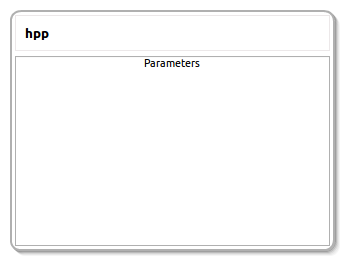

hpp
====================

General description
---------------------
The hpp package

Node: hpp
---------------------
#### Parameters
**urdfDescription** *(string, default: )*
<!--- protected region urdfDescription on begin -->
<!--- protected region urdfDescription end -->

**srdfDescription** *(string, default: )*
<!--- protected region srdfDescription on begin -->
<!--- protected region srdfDescription end -->

#### Published Topics
**path** *(sensor_msgs::JointState)*   
<!--- protected region path on begin -->
<!--- protected region path end -->

#### Subscribed Topics
**init_config** *(sensor_msgs::JointState)*   
<!--- protected region init_config on begin -->
<!--- protected region init_config end -->

**goal_config** *(sensor_msgs::JointState)*   
<!--- protected region goal_config on begin -->
<!--- protected region goal_config end -->

