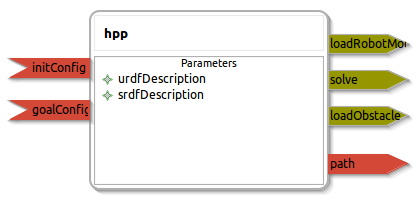

hpp_node
====================

General description
---------------------
The hpp_node package

Node: hpp
---------------------
#### Parameters
**urdfDescription** *(string, default: robot_description)*
<!--- protected region urdfDescription on begin -->
<!--- protected region urdfDescription end -->

**srdfDescription** *(string, default: robot_srdf)*
<!--- protected region srdfDescription on begin -->
<!--- protected region srdfDescription end -->

#### Published Topics
**path** *(trajectory_msgs::JointTrajectory)*
<!--- protected region path on begin -->
<!--- protected region path end -->

#### Subscribed Topics
**initConfig** *(sensor_msgs::JointState)*
<!--- protected region initConfig on begin -->
<!--- protected region initConfig end -->

**goalConfig** *(sensor_msgs::JointState)*
<!--- protected region goalConfig on begin -->
<!--- protected region goalConfig end -->

**initObjectPose** *(geometry_msgs::PoseStamped)*
<!--- protected region initObjectPose on begin -->
<!--- protected region initObjectPose end -->

**goalObjectPose** *(geometry_msgs::PoseStamped)*
<!--- protected region goalObjectPose on begin -->
<!--- protected region goalObjectPose end -->
